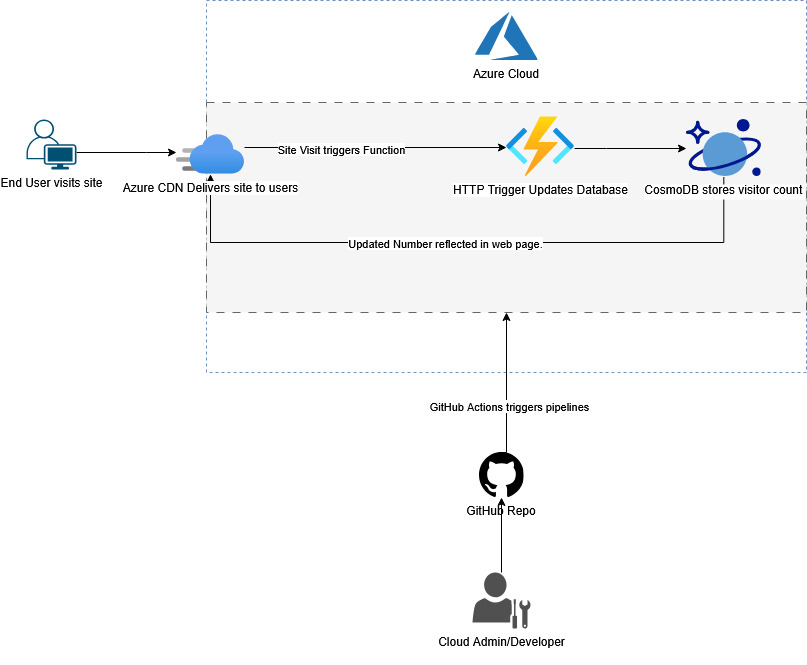

# Cloud Resume Challenge Azure
My attempt at Forrest Brazeal's Cloud Resume Challenge (https://cloudresumechallenge.dev/) using MS Azure.

The goal of this Challenge is to deploy a static web page that will host my resume (or similar "about me" info) with a visible counter that tracks
how many users have visited the site.

This is the architecture of the project:

** Architecture Picture Here **

This is the basic structure of this repo:

Static Website - Houses the backend Azure Function, written in Python, as well as the frontend HTML, CSS, and JavaScript.
IaC - "Infrastructure as Code", where all the Terraform scripts and configuration will go to deploy the resume automatically.
Notes.txt - My raw notes based on my experience. Will probably be the basis for my blog post once the Challenge in complete.

